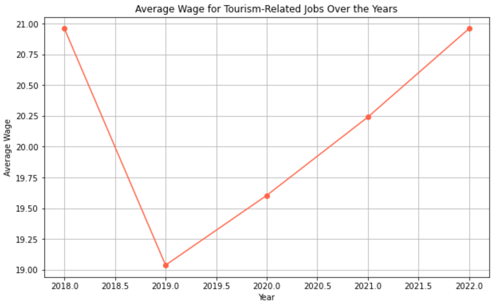

# ENDG 310
## Project #1 - Visualizing Data
Author: Isabel Conklin

## Overview

This project compares the amount of people travelling to Canada with the wages of people in Canada working jobs related to tourism. These jobs include tour guides, transportation, hospitality, retail, and many others. 

## Finding the Data

The first step in this project was to find data. I found the data on the government of Canada's opensource data website. I used the filters on the website to specify what organizations I would like the data to be from and what format I would like the data to be in (I requested a csv file). Then I moved the csv files to my file on VScode. 

## Organizing the Data

Next I wanted to organize the data. I decided to organize it in a way similar to what I did for my lab 2 project. I made year arrays for both datasets and also sorted by travellers_report data by season. Before I was able to make year arrays for the wages datasets, I had to add year columns to all of my csv files (I had one for each year from 2018-2022). After I added year columns I merged all of the csv files into one csv file. Then I filtered the wages dataset to only include jobs associated with tourism.

## Plotting the Graphs

The next step was to plot the graphs. I originally decided to plot my graphs using matplotlib and then to make them interactive in the infographic using plotly later. I made three graphs in matplotlib and then I spoke to some classmates and realized that it would probably be easier to make the graphs themselves interactive and then simply use them to make the infographic interactive. I then made three graphs in plotly, one line chart, one scatter plot, and one pie chart. These were all using one dataset, the line and pie charts used the travellers data, and the scatter plot used the wages data. After createing these graphs I wanted a graph which would plot both datasets together. I decided to make a bar chart with a line graph on top. I first started out using plotly but then I realized that I wanted to have two y-axes and plotly does not support that. Once I realized this I used matplotlib to generate it since I had not planned on makin that graph interactive anyway. Once I completed that graph I was ready to create my infographic. Here are screenshots of my first three initial graphs made in matplotlib, followed by my plotly graphs and my last matplotlib graph.

## Creating the Infographic

The last step in my project was to create my infographic. I decided to use the last four graphs that I created (they are in the python notebook called Ploty_Graphs) in my infographic. I save these files as png or html files so that I could imbed them in my infographic. I made the infographic as a html file as well. In order to access the web version of my infographic on your computer, go into Project_1_Notebook to the infograpic section and run the cell. Then it will save the html file to infographic.html. Then copy the filepath and paste it into a web browser. It should then bring you to the infographic. Below I am including a pdf version of my infographic.

[Infographic pdf]("Tourism and Wages in Canada.pdf")

## Code Organization

When I originally started making my graphs using matplotlib, I put all of my work in a main file (Project_1_Notebook.ipynb) and called functions which I had made. In this this file there is the data organization step, the calls for the function which made the orginal graphs and the final infographic. The only code missing from this file is the functions themselves,w hich can be found in the functions folder, the code for the plotly graphs and the last matplotlib graph. The code for these four graphs can be found in the Plotly_Graphs.ipnyb notebook. When I was making these graphs I intended to make the code into functions and then put the calls in my Project_1_Notebook.ipynb file but unfortunately I ran out of time.

## Conclusion

Finally, throughout this project I explored the conectino between the wages of individuals working jobs impacted by tourism and tourism itself. I have discovered that while there is a correlation between the two, it is not particularily strong. 

## References
